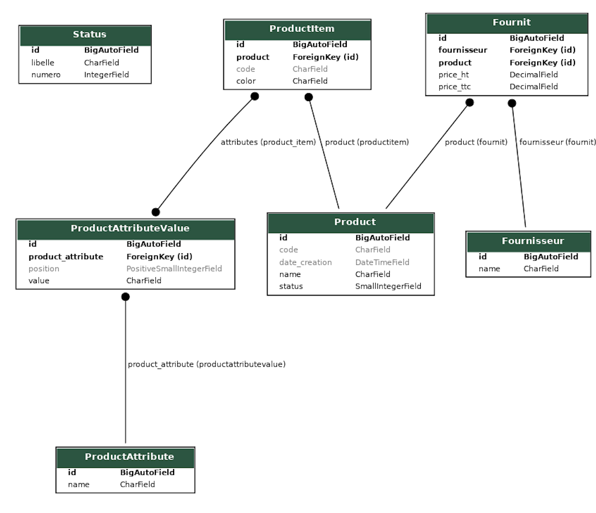
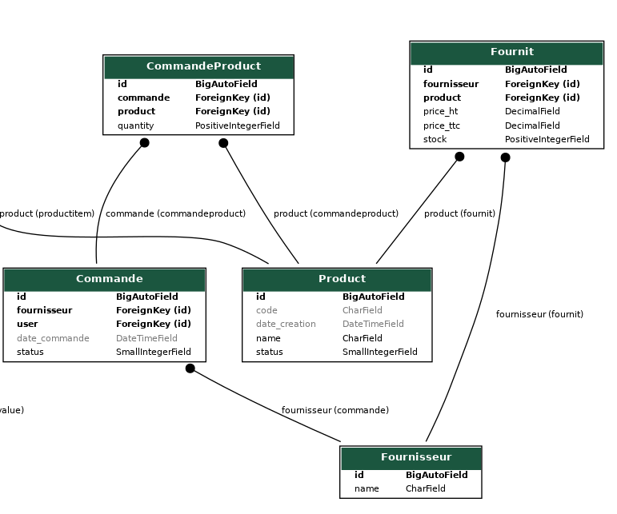

# Django

## Membres du projet

## Objectif

Ce dépot était un projet de test pour apprendre à utiliser Django. 
Maintenant il est utilisé pour réaliser un TP noté.

Le projet de base comportée une application de gestion de produits. Le but du projet est de rajouter des fournisseurs et des commandes.

## Installation

1. Cloner le dépot
2. Exécuter `./setup.sh` pour mettre en place tout le projet et peupler la BD
3. Exécuter `python manage.py runserver` pour lancer le serveur de développement

# Analyse du sujet TD noté

## Ajout du fournisseur

Dans la logique de l'application, un fournisseur est une personne morale qui fournit des produits.
L'objectif était de permettre d'ajouter les fournisseurs et de les associer à des produits.

### Changements

- Création du modèle `Fournisseur`
- Ajout de la relation `Fournit` entre `Fournisseur` et `Produit`
- Déplacement des prix du produit dans le modèle `Fournit` (car le prix dépend maintenant du fournisseur)

On a donc maintenant un modèle qui lie un fournisseur à des produits et des produits à des fournisseurs.

### MCD

### Tâches réalisées sur cette partie

- [x] Création du modèle `Fournisseur`
- [x] Création de la relation `Fournit`
- [x] Modification du modèle `Produit` pour ajouter la relation `Fournit`
- [x] Modification de l'interface d'administration pour gérer les fournisseurs
- [x] Modification de l'interface d'administration pour gérer les relations `Fournit`
- [x] Modification de l'interface d'administration pour gérer les produits
- [x] CRUD entier pour les fournisseurs hors de l'interface d'administration

## Ajout des commandes

Dans la logique de l'application, une commande est une liste de produits commandés par un client sur un même fournisseur.
L'objectif était de permettre d'ajouter les commandes et de les associer à des produits.

### Changements

- Création du modèle `Commande`
- Ajout de la relation `CommandeProduct` entre `Commande` et `Produit`
- Comme une commande est sur un même fournisseur, une commande est aussi liée à un fournisseur

On a donc maintenant un modèle qui lie une commande à des produits et des produits à des commandes, ainsi donc à un fournisseur.

### Tâches réalisées sur cette partie

- [x] Création du modèle `Commande`
- [x] Création de la relation `CommandeProduct`
- [x] Ajout de la fenêtre de toutes les commandes pour les administateurs et uniquement pour eux. Personne d'autre ne peut voir les commandes.
- [x] Ajout du CRUD pour les commandes pour les administateurs
- [x] Si une commande est 'passée' ou 'reçue', on ne peut plus la modifier ou la supprimer, sinon si elle est 'en préparation' alors on peut la modifier ou la supprimer.
- [x] Possibilité de passer une commande uniquement si on est administrateur

## Commandes importantes

- `python manage.py runserver` : lance le serveur de développement
- `python manage.py makemigrations` : crée les migrations
- `python manage.py migrate` : applique les migrations
- `python manage.py createsuperuser` : crée un super utilisateur
- `python manage.py startapp` : crée une application
- `python manage.py shell` : ouvre la console Python
- `python manage.py sqlmigrate 0001 LesProduits` : affiche le SQL d'une migration
